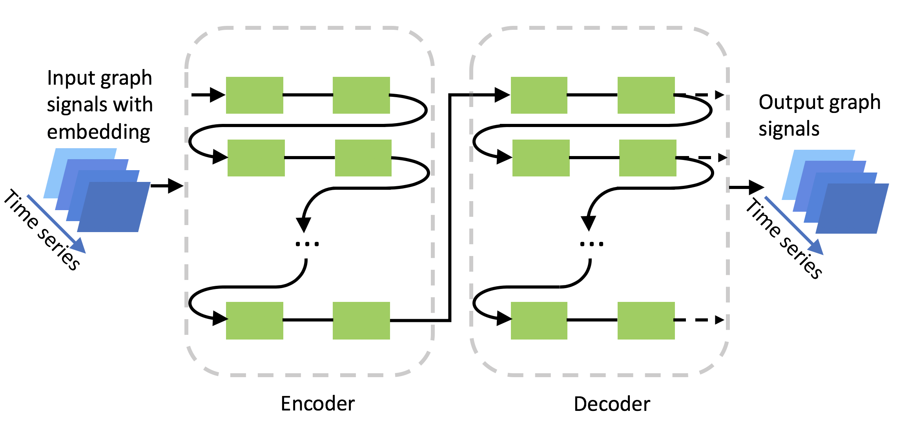

# Traffic Forecasting with Graph Embedding



This project inherits the main structure of DCRNN described in the following paper: \
Yaguang Li, Rose Yu, Cyrus Shahabi, Yan Liu, [Diffusion Convolutional Recurrent Neural Network: Data-Driven Traffic Forecasting](https://arxiv.org/abs/1707.01926), ICLR 2018.

More specifically, we replaced graph convolution with a fully-connected layer. We also added graph embeddings from *node2vec* and *SDNE* as invariant features to the input matrix.

## 1, Graph Construction
Current implementation currently only supports sensor ids in Los Angeles (see `data/sensor_graph/sensor_info_201206.csv`). We prepare the graph data as follows:

```bash
python -m scripts.gen_adj_mx.py  --sensor_ids_filename=data/sensor_graph/graph_sensor_ids.txt --normalized_k=0.1\
--output_pkl_filename=data/sensor_graph/adj_mx.pkl
```
In file `ProduceEdgeList.ipynb`, we inspect the dimension, directedness and other features of the adjacency matrix of LA highway sensor system.

## 2, Traffic Data Preparation
The traffic data file for Los Angeles, i.e., `df_highway_2012_4mon_sample.h5`, is available [here](https://drive.google.com/open?id=1tjf5aXCgUoimvADyxKqb-YUlxP8O46pb), and should be
put into the `data/METR-LA` folder.
Besides, the locations of sensors are available at [data/sensor_graph/graph_sensor_locations.csv](https://github.com/liyaguang/DCRNN/blob/master/data/sensor_graph/graph_sensor_locations.csv).
```bash
python -m scripts.generate_training_data --output_dir=data/METR-LA
```
The generated train/val/test dataset will be saved at `data/METR-LA/{train,val,test}.npz`.

## 3, Graph Embedding Data Preparation
Follow the instructions in file `embeddings.ipynb`, we produce graph embeddings of designated dimension, which later is attached to the input feature matrix and is then fed to the fully connected neural network.

Activate Python2 environment for node2vec by`source activate cs224w`;
Then either generate a single node2vec by
`python n2v-main.py --input METR-LA.txt --output LA-n2v-temp.txt --dimensions 8 --p 1 --weighted --directed`
or by `sh generate-hyperparam-grid.sh` to generate our hyperparameter grid.

## 4, Model Training

Data files in **npy** formats should be in the same subdirecotry with **exec.sh**.

If you do trianing on single GPU, use `exec.sh` as follows.
```bash
sh exec.sh LA-n2v-2-0.1-1
```
If you want  to make use of multiple GPUs (we used 8 Tesla K80 in the last stage of our work), use `para_exec.sh` instead. However, please pay attent to your disk type on the cluster. Disk I/O might be a limiting factor in your project development. We tried to run 8 training screens on each of our 8 K80 GPUs, but crashed because our disk on Google Cloud does not endure the amount of Disk I/O the trainings are producing. We trained 4 simutaneously instead. Note `file1` are names of files without `.npy`.

```bash
sh para_exec.sh file1 file2 file3 ... 
```

Each epoch takes about 5min with a single GTX 1080 Ti (on DCRNN by author of paper). Out running time on AWS Tesla K80 takes 15 minues for each epoch (DCRNN, by us).

On AWS Tesla K80, each epoch only takes 1-2 min (at least 90% faster, on FCRNN, by us). On NVIDIA P100, each epoch takes only 30 seconds.

## 5, Model evaluation

The preferred way is to actually make use of the log information.

Also, we can evaluate the trained models using `run_demo.py`. Please notice you need to adjust files, directories personally.

```bash
python run_demo.py --config_filename './data/model/dcrnn_DR_2_h_12_64-64_lr_0.01_bs_64_1108092636/config_55.yaml' --output_filename 'dcrnn.npz'
```

## 6, Visualization

See `plot.ipynb` for the visualization of results.

## 7, Please cite original paper as specified by authors

If you find this repository useful in your research, please cite the following papers:
```
@inproceedings{li2018dcrnn_traffic,
title={Diffusion Convolutional Recurrent Neural Network: Data-Driven Traffic Forecasting},
author={Li, Yaguang and Yu, Rose and Shahabi, Cyrus and Liu, Yan},
booktitle={International Conference on Learning Representations (ICLR '18)},
year={2018}
}

@inproceedings{grover2016node2vec,
title={node2vec: Scalable feature learning for networks},
author={Grover, Aditya and Leskovec, Jure},
booktitle={Proceedings of the 22nd ACM SIGKDD international conference on Knowledge discovery and data mining},
pages={855--864},
year={2016},
organization={ACM}
}

@inproceedings{wang2016structural,
title={Structural deep network embedding},
author={Wang, Daixin and Cui, Peng and Zhu, Wenwu},
booktitle={Proceedings of the 22nd ACM SIGKDD international conference on Knowledge discovery and data mining},
pages={1225--1234},
year={2016},
organization={ACM}
}
```
